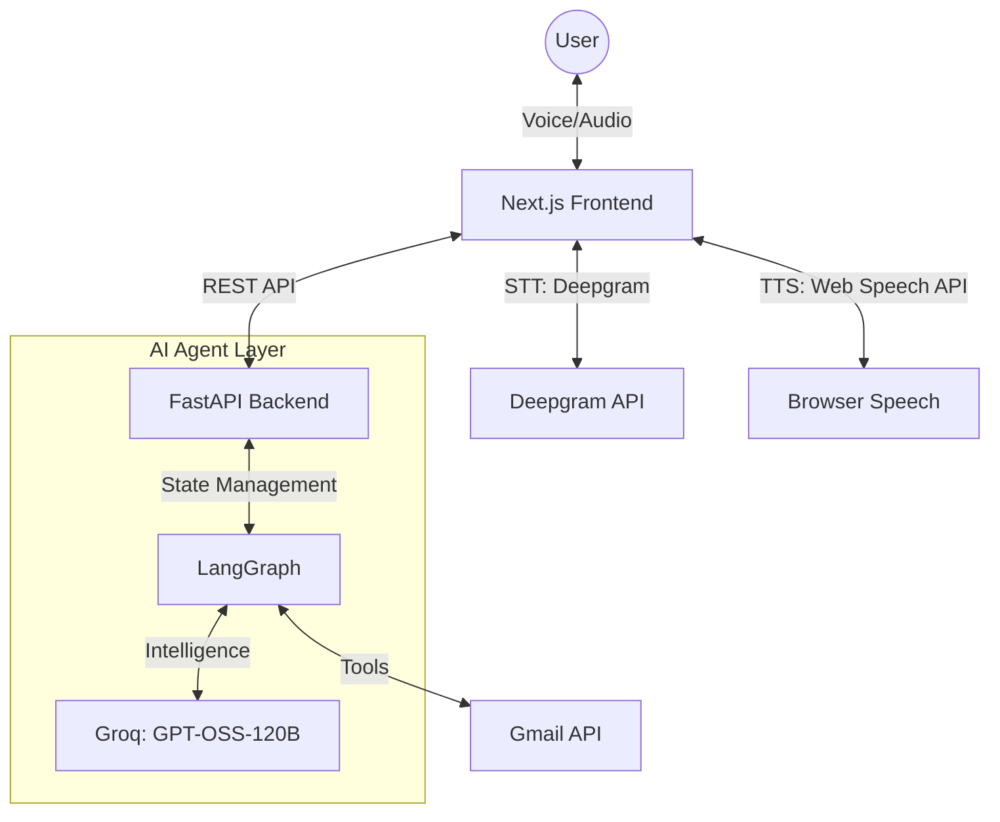

# Email Voice AI Agent

**Email Voice AI Agent** is an intelligent, **voice-first AI email assistant** designed to make inbox management completely hands-free. Built with **LangGraph**, **FastAPI**, **Gmail API**, and **Next.js**, this agent allows you to read, summarize, star, and compose emails through natural conversation.

---

## Features

### Voice-Driven Email Management
- **Inquiry**: "Read my latest emails" or "What's in my inbox?"
- **Filtering**: "Read emails from Amazon" or specific senders.
- **Smart Summarization**: Automatically summarizes long emails for quick voice consumption.
- **Image Intelligence**: Detects image-only emails and describes them intelligently.

### Conversational Compose & Send
- **Natural Flow**: Guide the agent through recipient, subject, and body.
- **Draft Enhancement**: Say "enhance this" to make your draft more professional, shorter, or funnier.
- **Final Confirmation**: Voice-confirmed sending to prevent accidental emails.

### Inbox Actions
- **Triage**: Star/unstar, delete, or "untrash" (undo delete) via voice.
- **Navigation**: Move through your inbox with simple "Next" and "Previous" commands.
- **Session Control**: Voice-activated pause, resume, and full conversation reset.

---

## Architecture

The agent uses a modern AI stack to handle real-time voice processing and complex agentic workflows.



---

## Technical Stack

- **Frontend**: Next.js 15+, Tailwind CSS, Framer Motion.
- **Language Processing**: Deepgram (Voice-to-Text), Web Speech API (Text-to-Voice).
- **Orchestration**: LangGraph (Agentic state machine).
- **Backend**: FastAPI (Python).
- **LLM**: Groq (Llama/Mixtral models).
- **Email Service**: Google Gmail API.

---

## Setup Guide

### 1. Prerequisites
- Python 3.10+ & Node.js 18+
- [Google Cloud Project](https://console.cloud.google.com/) with Gmail API enabled.
- API Keys: [Groq](https://console.groq.com/) and [Deepgram](https://console.deepgram.com/).

### 2. Backend Configuration
Navigate to `backend/`:
```bash
pip install -r requirements.txt
```
1. Create a `.env` file:
   ```env
   GROQ_API_KEY=your_groq_key_here
   ```
2. Place your Google `credentials.json` in the `backend/` folder.
3. Run the server:
   ```bash
   python app.py
   ```
   *On first run, complete the OAuth flow in your browser.*

### 3. Frontend Configuration
Navigate to `frontend/frontend/`:
```bash
npm install
```
1. Create a `.env.local` file:
   ```env
   NEXT_PUBLIC_DEEPGRAM_API_KEY=your_deepgram_key_here
   ```
2. Run the development server:
   ```bash
   npm run dev
   ```

---

## Roadmap
- [ ] Multi-provider support (Outlook/iCloud).
- [ ] Local LLM support for enhanced privacy.
- [ ] Improved interruption handling during voice playback.
- [ ] Attachment management via voice.

---
*Created by [Vatsa](https://github.com/vatsa10)*


